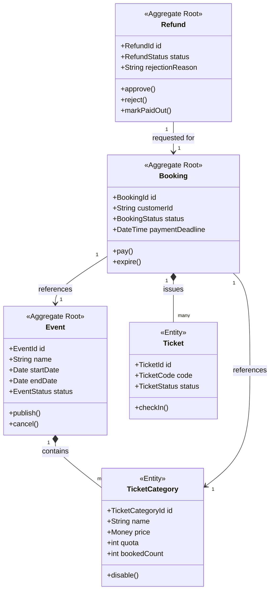

# Event Management System
Event Ticketing & Booking System built with FastAPI, Clean Architecture, and Domain-Driven Design.

## Tech Stack
- Python + FastAPI
- PostgreSQL
- SQLAlchemy + Alembic
- JWT Authentication

## How to Run

### 1. Clone & Setup
```bash
git clone <repo-url>
cd event-management-system
python -m venv venv
venv\Scripts\Activate.ps1  # Windows
pip install -r requirements.txt
```

### 2. Configure PostgreSQL
Copy `.env.example` to `.env` and fill in your database credentials.

### 3. Run Migration
```bash
alembic upgrade head
```

### 4. Run Tests
```bash
pytest tests/
```

### 5. Run App
```bash
uvicorn main:app --reload
```

## Architecture
- `app/domain/` — Aggregates, Entities, Value Objects, Domain Events
- `app/application/` — Commands, Queries, Handlers, Interfaces
- `app/infrastructure/` — DB, Repositories, External Services
- `app/presentation/` — REST API Controllers


---

## Implemented User Stories

<!-- Update this section as user stories are implemented -->

| # | User Story | Status |
|---|---|---|
| 1 | Create Event | ⬜ |
| 2 | Publish Event | ⬜ |
| 3 | Cancel Event | ⬜ |
| 4 | Create Ticket Category | ⬜ |
| 5 | Disable Ticket Category | ⬜ |
| 6 | View Available Events | ⬜ |
| 7 | View Event Details | ⬜ |
| 8 | Create Ticket Booking | ⬜ |
| 9 | Calculate Booking Total Price | ⬜ |
| 10 | Pay Booking | ⬜ |
| 11 | Expire Booking | ⬜ |
| 12 | View Purchased Tickets | ⬜ |
| 13 | Check In Ticket | ⬜ |
| 14 | Reject Invalid Ticket Check-in | ⬜ |
| 15 | Request Refund | ⬜ |
| 16 | Approve Refund | ⬜ |
| 17 | Reject Refund | ⬜ |
| 18 | Mark Refund as Paid Out | ⬜ |
| 19 | View Event Sales Report | ⬜ |
| 20 | View Event Participants | ⬜ |

---

## Implemented Domain Events

<!-- Update this section as domain events are implemented -->

| Domain Event | Trigger | Status |
|---|---|---|
| EventCreated | Event organizer creates a new event | ⬜ |
| EventPublished | Event organizer publishes an event | ⬜ |
| EventCancelled | Event organizer cancels an event | ⬜ |
| TicketCategoryCreated | Ticket category added to event | ⬜ |
| TicketCategoryDisabled | Ticket category disabled | ⬜ |
| TicketReserved | Customer creates a booking | ⬜ |
| BookingPaid | Customer pays for booking | ⬜ |
| BookingExpired | Payment deadline passed without payment | ⬜ |
| TicketCheckedIn | Gate officer checks in a ticket | ⬜ |
| RefundRequested | Customer requests a refund | ⬜ |
| RefundApproved | Organizer approves refund | ⬜ |
| RefundRejected | Organizer rejects refund | ⬜ |
| RefundPaidOut | Admin marks refund as paid out | ⬜ |

---

## Implemented Application Service Interfaces

<!-- Update this section as interfaces are implemented -->

| Interface | Description | Status |
|---|---|---|
| PaymentGatewayInterface | Process booking payments | ⬜ |
| RefundPaymentServiceInterface | Process refund payouts to customers | ⬜ |
| NotificationServiceInterface | Send email or WhatsApp notifications | ⬜ |

---

## Aggregates & Business Rules

### Event
Manages event lifecycle and ticket categories.

**Business Rules:**
- End date cannot be earlier than start date
- Max capacity must be greater than zero
- Must have at least one active ticket category to be published
- Total ticket quota across all categories cannot exceed max capacity
- Cancelled event cannot be published
- Completed event cannot be cancelled

### Booking
Manages the reservation and payment lifecycle of a customer's ticket order.

**Business Rules:**
- Can only be created for Published events
- Can only be created within the ticket sales period
- Quantity must be greater than zero
- Quantity cannot exceed remaining quota
- Customer cannot have more than one active booking per event
- Payment deadline is 15 minutes after booking is created
- Payment amount must exactly match total price
- Cannot pay after payment deadline has passed
- Paid booking cannot be expired

### Refund
Manages the refund request and payout process.

**Business Rules:**
- Can only be requested for Paid bookings
- Cannot be requested if any ticket in the booking has already been checked in
- Can only be approved or rejected if status is Requested
- Rejection must include a reason
- Can only be marked as paid out if status is Approved
- Paid-out refund cannot be modified again

---

## 🚀 Project Roadmap & Progress Tracking
This project follows the development timeline and milestones specified in the "Case Study - Event Management System.pdf".

### **Week 8: Project Structure**
- [x] Initialize Clean Architecture folder structure (Domain, Application, Infrastructure, Presentation)
- [x] Define initial business rules based on user stories and acceptance criteria
- [x] Draft initial Domain Model
- [x] Document initial Ubiquitous Language glossary

### **Week 9-10: Domain Layer & Unit Tests**
- [ ] Implement DDD tactical patterns: Aggregates, Entities, and Value Objects
- [ ] Implement Domain Services and Domain Events
- [ ] Define Repository Interfaces
- [ ] Write and pass Unit Tests for domain logic

### **Week 11: Application Layer**
- [ ] Implement Commands, Queries, and their respective Handlers
- [ ] Create Data Transfer Objects (DTOs)
- [ ] Define Application Service Interfaces for external system interactions

### **Week 12: Infrastructure Layer**
- [ ] Design PostgreSQL schema and migration files
- [ ] Implement Repository interfaces using PostgreSQL
- [ ] Implement Application Service implementations (Payment Gateway, Notifications, etc.)
- [ ] Configure database connections and environment settings

### **Week 13: Presentation Layer & Final Integration**
- [ ] Implement REST API Controllers
- [ ] Verify working endpoints with request/response examples
- [ ] Ensure full integration between Controller, Application, Infrastructure, and Database layers

---

*Note: Progress is updated weekly following the course milestones.*


Ini bagian-bagian yang perlu ditambahin, paste setelah section Architecture yang sudah ada:

---

### Setelah bagian `## Architecture`, tambahkan:

## DDD & Clean Architecture Terms

| Term | Meaning |
|---|---|
| **Aggregate** | A cluster of domain objects treated as a single unit for data changes. |
| **Entity** | A domain object with a unique identity that persists over time. |
| **Value Object** | An object defined only by its attributes with no unique identity (e.g., `Money`). |
| **Domain Event** | A notification of a significant change within the domain logic. |
| **Repository** | An interface for persisting and retrieving Aggregates from the database. |
| **Domain Service** | Business logic that doesn't naturally belong inside a single Entity or Aggregate. |
| **Command** | An object representing an intent to change the state of the system. |
| **Query** | An object representing a request to retrieve data without changing it. |
| **Handler** | The specific logic that executes a Command or a Query. |
| **DTO** | Data Transfer Object used to move data between layers. |

---

## Domain Model



---

## Repository Interfaces

| Interface | Methods |
|---|---|
| **EventRepository** | `save(Event)`, `find_by_id(EventId)`, `find_all_published()` |
| **BookingRepository** | `save(Booking)`, `find_by_id(BookingId)`, `find_by_customer_and_event(customerId, EventId)`, `find_paid_by_event(EventId)` |
| **RefundRepository** | `save(Refund)`, `find_by_id(RefundId)`, `find_by_booking_id(BookingId)` |

---

## Business Rules

### Event & Ticket Category
- Event end date cannot be earlier than start date
- Event max capacity must be greater than zero
- Event must have at least one active ticket category to be published
- Cancelled event cannot be published, completed event cannot be cancelled
- Ticket category price cannot be negative, quota must be greater than zero
- Ticket category sales period must end before or at event start date
- Total quota of all ticket categories cannot exceed event max capacity

### Booking & Payment
- Booking can only be created for Published events within the sales period
- Ticket quantity must be greater than zero and not exceed remaining quota
- Customer cannot have more than one active booking per event
- Payment deadline is 15 minutes after booking is created
- Payment amount must exactly match total price
- Booking cannot be paid after payment deadline
- Paid booking cannot be expired

### Check-in & Refund
- Check-in can only be performed on the event day with an Active ticket
- Checked-in ticket cannot be checked in again
- Refund can only be requested for Paid bookings with no checked-in tickets
- Refund approval/rejection only possible if status is Requested
- Rejection must include a reason
- Refund can only be marked as paid out if status is Approved

---
## Folder Structure

```text
event-management-system/
├── app/
│   ├── domain/                  # Enterprise business rules, zero external dependencies
│   │   ├── aggregates/          # Event, Booking, Refund aggregates & their entities
│   │   ├── repositories/        # Repository interfaces (abstract, no implementation)
│   │   ├── services/            # Domain services for cross-aggregate logic
│   │   ├── value_objects.py     # Money, TicketCode, and ID value objects
│   │   └── events.py            # All domain events
│   ├── application/             # Use cases: commands, queries, handlers, DTOs
│   ├── infrastructure/          # DB, repository implementations, external services
│   └── presentation/            # REST API controllers and routing
├── tests/
│   └── domain/                  # Unit tests for domain logic
├── main.py
└── requirements.txt
```

